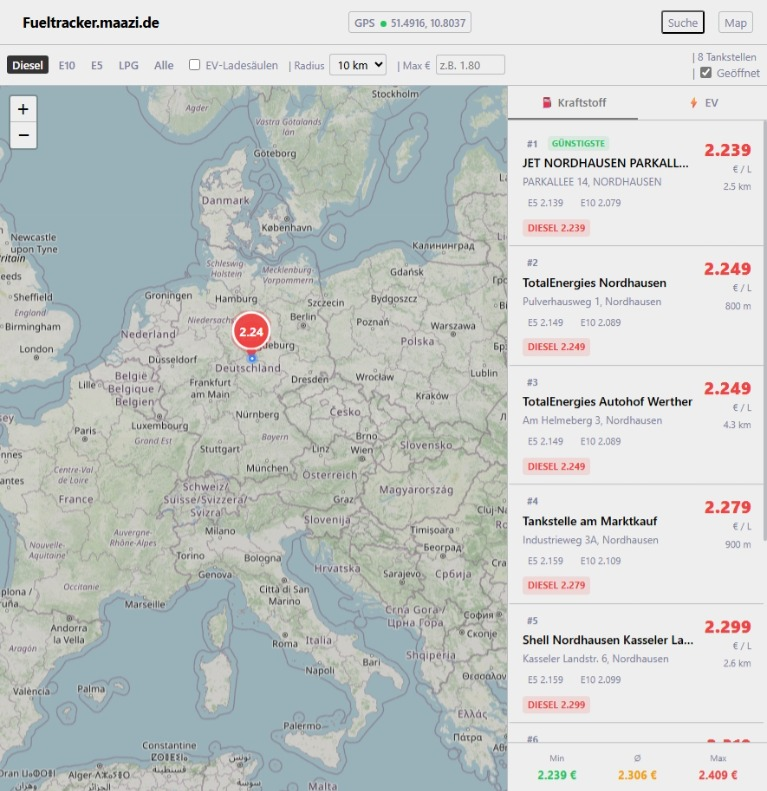

# ⛽ FuelTracker Europa

Kraftstoffpreise in Echtzeit — Deutschland, DACH und ganz Europa.
GPS-Standortermittlung, interaktive Karte, Preisfilter nach Kraftstoffart.

## Features

- **GPS-Ortung** via Browser Geolocation API
- **Leaflet.js + OpenStreetMap** (100% kostenlos)
- **Kraftstoffe**: Diesel · E5 · E10 · LPG · EV-Ladesäulen
- **Stufe 1 DE**: Tankerkönig API (~15.000 Stationen, Live)
- **Stufe 2 AT**: E-Control Spritpreisrechner (Live)
- **Stufe 2 FR**: prix-carburants.gouv.fr (offiziell)
- **Stufe 3 EU**: Scraper für mylpg.eu, ADAC + OSM-Fallback
- **EV**: Open Charge Map (europaweite Ladesäulen)
- Redis Cache · SQLite Persistenz · Cron-Refresh

---

## Schnellstart



### 1. Repo klonen / Dateien hochladen

```bash
git clone https://github.com/dein-user/fueltracker.git
cd fueltracker
```

### 2. Umgebungsvariablen setzen

```bash
cp backend/.env.example backend/.env
nano backend/.env
```

**Wichtige Werte in `.env`:**

| Variable                | Wert     | Wo beantragen                              |
| ----------------------- | -------- | ------------------------------------------ |
| `TANKERKOENING_API_KEY` | Dein Key | https://creativecommons.tankerkoenig.de    |
| `OCM_API_KEY`           | Dein Key | https://openchargemap.org/site/develop/api |
| `ANTHROPIC_API_KEY`     | Optional | https://console.anthropic.com              |

### 3. Starten

```bash
docker compose up -d --build
```

### 4. Logs prüfen

```bash
docker compose logs -f backend
docker compose logs -f frontend
```

---

## API-Dokumentation

### `GET /api/v1/stations/nearby`

Sucht Tankstellen im Umkreis.

| Parameter  | Typ    | Default  | Beschreibung                    |
| ---------- | ------ | -------- | ------------------------------- |
| `lat`      | float  | –        | Breitengrad (Pflicht)           |
| `lng`      | float  | –        | Längengrad (Pflicht)            |
| `radius`   | int    | 10       | Suchradius in km (max 50)       |
| `fuel`     | string | `diesel` | `e5`·`e10`·`diesel`·`lpg`·`all` |
| `maxPrice` | float  | –        | Max. Preis in €/L               |
| `onlyOpen` | bool   | `true`   | Nur geöffnete                   |
| `limit`    | int    | 20       | Max. Ergebnisse                 |

```bash
curl "https://yourdomain.com/api/v1/stations/nearby?lat=48.137&lng=11.576&radius=5&fuel=diesel"
```

### `GET /api/v1/ev/nearby`

EV-Ladesäulen im Umkreis.

| Parameter   | Typ   | Default | Beschreibung          |
| ----------- | ----- | ------- | --------------------- |
| `lat`,`lng` | float | –       | Koordinaten (Pflicht) |
| `radius`    | int   | 15      | km                    |
| `minKw`     | float | –       | Min. Ladeleistung     |

### `GET /api/v1/stations/country/:code`

Letzter bekannter Stand für ein Land (Stufe 3 Fallback).
Beispiel: `/api/v1/stations/country/IT`

### `GET /api/v1/prices/europe`

ADAC-Übersicht mit Durchschnittspreisen aller EU-Länder.

### `GET /api/v1/prices/stats`

Statistiken aus der lokalen Datenbank (Min/Max/Avg pro Land + Kraftstoff).

---

## Projektstruktur

```
fueltracker/
├── backend/
│   ├── src/
│   │   ├── api/           # REST-Endpunkte
│   │   │   ├── stations.js     # Haupt-API
│   │   │   ├── prices.js       # Preisübersicht
│   │   │   └── ev.js           # EV-Ladesäulen
│   │   ├── scrapers/      # Datenquellen
│   │   │   ├── tankerkoening.js   # 🇩🇪 Stufe 1 Live
│   │   │   ├── econtrol.js        # 🇦🇹 Stufe 2 Live
│   │   │   ├── europe-fallback.js # Stufe 3 Scraper
│   │   │   └── ev-ocm.js          # EV Open Charge Map
│   │   ├── cache/
│   │   │   ├── redis.js          # Redis-Wrapper
│   │   │   └── database.js       # SQLite-Schema + Helpers
│   │   ├── scheduler/
│   │   │   └── index.js          # Cron-Jobs
│   │   └── utils/
│   │       └── logger.js         # Winston Logger
│   ├── .env.example
│   └── Dockerfile
├── frontend/
│   ├── src/
│   │   ├── App.jsx
│   │   ├── components/
│   │   │   ├── MapView.jsx       # Leaflet-Karte
│   │   │   ├── Sidebar.jsx       # Preisliste
│   │   │   ├── FilterBar.jsx     # Filter
│   │   │   ├── Header.jsx        # GPS + Nav
│   │   │   └── StationPopup.jsx  # Detail-Overlay
│   │   ├── hooks/
│   │   │   ├── useGeolocation.js
│   │   │   └── useStations.js
│   │   ├── store/
│   │   │   └── useStore.js       # Zustand State
│   │   └── utils/
│   │       └── api.js            # API-Client
│   └── Dockerfile
├── apache/
│   └── fueltracker.conf          # Apache VirtualHost
└── docker-compose.yml
```

---

## API-Keys beantragen (alle kostenlos)

### Tankerkönig (Pflicht für Deutschland)

1. → https://creativecommons.tankerkoenig.de
2. Formular ausfüllen, Key per Mail
3. Kostenlos, kein Ablaufdatum

### Open Charge Map (EV, optional)

1. → https://openchargemap.org/site/develop/api
2. Registrieren, Key sofort
3. Kostenlos, kein Limit für normale Nutzung

### E-Control AT (kein Key nötig!)

- Direkt nutzbar: `https://api.e-control.at/sprit/1.0`

### prix-carburants.gouv.fr (kein Key nötig!)

- Direkt nutzbar: `https://donnees.roulez-eco.fr/opendata/instantane`

---

## VPS-Empfehlung

Das Backend + Redis + Playwright braucht ca. **400-600 MB RAM** im Betrieb.

---
